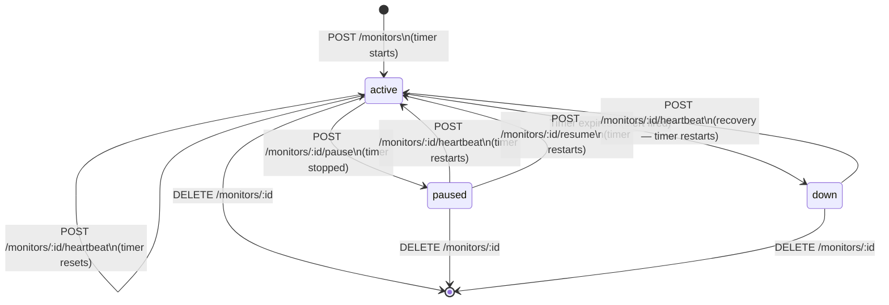
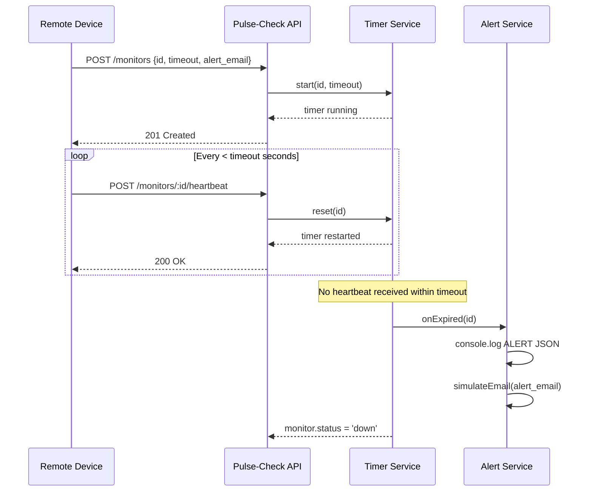

## Architecture Diagram

### State Flowchart — Monitor Lifecycle

```mermaid
stateDiagram-v2
    [*] --> active : POST /monitors\n(timer starts)

    active --> active : POST /monitors/:id/heartbeat\n(timer resets)
    active --> paused : POST /monitors/:id/pause\n(timer stopped)
    active --> down   : Timer expires\n(alert fired)

    paused --> active : POST /monitors/:id/heartbeat\n(timer restarts)
    paused --> active : POST /monitors/:id/resume\n(timer restarts)

    down --> active : POST /monitors/:id/heartbeat\n(recovery — timer restarts)

    active --> [*] : DELETE /monitors/:id
    paused --> [*] : DELETE /monitors/:id
    down   --> [*] : DELETE /monitors/:id
```

### Sequence Diagram — Normal Heartbeat Flow

```mermaid
sequenceDiagram
    participant Device as Remote Device
    participant API as Pulse-Check API
    participant Timer as Timer Service
    participant Alert as Alert Service

    Device->>API: POST /monitors {id, timeout, alert_email}
    API->>Timer: start(id, timeout)
    Timer-->>API: timer running
    API-->>Device: 201 Created

    loop Every < timeout seconds
        Device->>API: POST /monitors/:id/heartbeat
        API->>Timer: reset(id)
        Timer-->>API: timer restarted
        API-->>Device: 200 OK
    end

    Note over Timer: No heartbeat received within timeout
    Timer->>Alert: onExpired(id)
    Alert->>Alert: console.log ALERT JSON
    Alert->>Alert: simulateEmail(alert_email)
    Timer-->>API: monitor.status = 'down'
```

---
