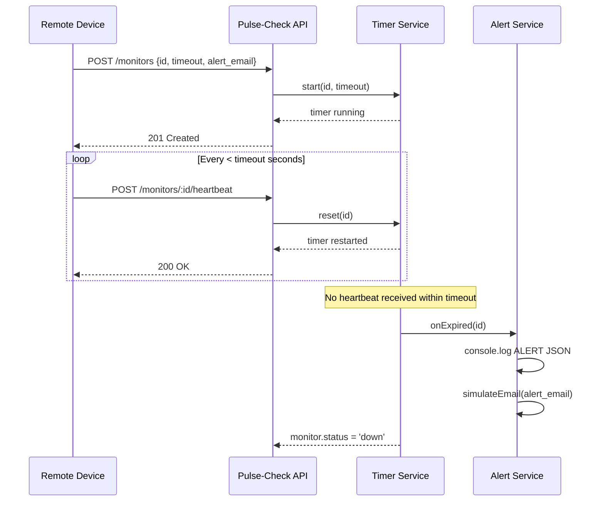

# Pulse-Check API — Watchdog Sentinel

> **Dead Man's Switch API for CritMon Servers Inc.**  
> A production-quality backend that monitors remote devices (solar farms, weather stations) and fires alerts when they stop sending heartbeats.

---

## Table of Contents

1. [Architecture Diagram](#architecture-diagram)
2. [Project Structure](#project-structure)
3. [Setup Instructions](#setup-instructions)
4. [API Documentation](#api-documentation)
5. [Design Decisions](#design-decisions)
6. [Developer's Choice Feature](#developers-choice-feature)
7. [How the System Works](#how-the-system-works)

---

## Architecture Diagram

 
### Sequence Diagram — Normal Heartbeat Flow



---


## Project Structure

```
Pulse-Check/
├─── app.js                      - Express app entry point
│   ├── routes/
│   │   ├── monitors.js             - Monitor route definitions
│   │   └── system.js               - Health-check & root routes
│   ├── controllers/
│   │   └── monitorController.js    - HTTP -> service mapping
│   ├── services/
│   │   ├── monitorStore.js         - In-memory Map (singleton)
│   │   ├── timerService.js         - setTimeout lifecycle management
│   │   ├── monitorService.js       - Business logic orchestration
│   │   └── alertService.js         - Alert firing + email simulation
│   ├── middleware/
│   │   ├── requestLogger.js        - Per-request logging
│   │   ├── errorHandler.js         - Global error handler
│   │   └── notFound.js             - 404 catch-all
│   └── utils/
│       ├── validators.js           - Input validation (no external libs)
│       └── time.js                 - Centralised ISO timestamp
├── package.json
├── .gitignore
└── README.md
```


---

## Setup Instructions

### Prerequisites

- **Node.js** ≥ 18.0.0
- **npm** ≥ 8.0.0

### Install & Run

```bash
git clone https://github.com/MbarushimanaFabrice/AmaliTech-DEG-Project-based-challenges.git
cd AmaliTech-DEG-Project-based-challenges

npm install

npm start
```

Server starts on **http://localhost:4555** (override with `PORT=8080 npm start`).

You should see:

```
Pulse-Check API running on http://localhost:4555
Watchdog sentinel is active. Monitoring for silent devices...
```

### Development (auto-reload)

```bash
npm run dev
```

---

## API Documentation

### Base URL

```
http://localhost:4555
```

### Monitor Object Shape

```json
{
  "id": "device-123",
  "timeout": 60,
  "alert_email": "admin@critmon.com",
  "status": "active",
  "createdAt": "2025-01-15T10:00:00.000Z",
  "lastHeartbeat": null,
  "alertFiredAt": null,
  "missedBeats": 0
}
```

`status` is one of: **`active`** | **`paused`** | **`down`**

---

### Endpoints

#### `POST /monitors` — Register a Monitor

Starts a countdown timer for the given device.

**Request Body**

| Field         | Type    | Required | Description                              |
|---------------|---------|----------|------------------------------------------|
| `id`          | string  | yes      | Unique device ID (alphanumeric, hyphens) |
| `timeout`     | integer | yes      | Countdown duration in seconds (1–86400)  |
| `alert_email` | string  | yes      | Email to notify when device goes down    |

**Example Request**

```bash
curl -X POST http://localhost:4555/monitors \
  -H "Content-Type: application/json" \
  -d '{"id":"device-123","timeout":60,"alert_email":"admin@critmon.com"}'
```

**Example Response — 201 Created**

```json
{
  "message": "Monitor 'device-123' created. Countdown started (60s).",
  "monitor": {
    "id": "device-123",
    "timeout": 60,
    "alert_email": "admin@critmon.com",
    "status": "active",
    "createdAt": "2025-01-15T10:00:00.000Z",
    "lastHeartbeat": null,
    "alertFiredAt": null,
    "missedBeats": 0
  }
}
```

**Error — 409 Conflict (duplicate ID)**

```json
{
  "error": "Monitor 'device-123' already exists. Use DELETE /monitors/device-123 to remove it first, or send a heartbeat to reset the timer.",
  "code": "DUPLICATE_ID"
}
```

**Error — 400 Bad Request (validation)**

```json
{
  "error": "Validation failed",
  "details": "\"timeout\" must be at least 1 second."
}
```

---

#### `POST /monitors/:id/heartbeat` — Send a Heartbeat

Resets the countdown to full duration. Also unpauses a paused monitor or revives a downed monitor.

**Example Request**

```bash
curl -X POST http://localhost:4555/monitors/device-123/heartbeat
```

**Example Response — 200 OK**

```json
{
  "message": "Heartbeat received. Timer reset for 'device-123'.",
  "monitor": {
    "id": "device-123",
    "status": "active",
    "lastHeartbeat": "2025-01-15T10:00:45.000Z",
    ...
  }
}
```

**Error — 404 Not Found**

```json
{
  "error": "Monitor 'device-123' not found.",
  "code": "NOT_FOUND"
}
```

---

#### `POST /monitors/:id/pause` — Pause a Monitor

Stops the timer without triggering an alert. Use this during planned maintenance.

```bash
curl -X POST http://localhost:4555/monitors/device-123/pause
```

**Response — 200 OK**

```json
{
  "message": "Monitor 'device-123' paused. Timer stopped. No alerts will fire.",
  "monitor": { "id": "device-123", "status": "paused", ... }
}
```

---

#### `POST /monitors/:id/resume` — Resume a Paused Monitor

Explicitly restarts the timer after a pause (sending a heartbeat also resumes).

```bash
curl -X POST http://localhost:4555/monitors/device-123/resume
```

**Response — 200 OK**

```json
{
  "message": "Monitor 'device-123' resumed. Timer restarted from full 60s.",
  "monitor": { "id": "device-123", "status": "active", ... }
}
```

---

#### `GET /monitors` — List All Monitors

Optional query param: `?status=active|paused|down`

```bash
curl http://localhost:4555/monitors
curl http://localhost:4555/monitors?status=down
```

**Response — 200 OK**

```json
{
  "ok": true,
  "monitors": [ { ... }, { ... } ],
  "total": 2
}
```

---

#### `GET /monitors/stats` — Aggregate Statistics *(Developer's Choice)*

Returns a fleet-level summary of all monitors.

```bash
curl http://localhost:4555/monitors/stats
```

**Response — 200 OK**

```json
{
  "ok": true,
  "stats": {
    "total": 5,
    "by_status": {
      "active": 3,
      "paused": 1,
      "down": 1
    },
    "total_missed_beats": 2,
    "generatedAt": "2025-01-15T10:05:00.000Z"
  }
}
```

---

#### `GET /monitors/:id` — Get a Single Monitor

```bash
curl http://localhost:4555/monitors/device-123
```

---

#### `DELETE /monitors/:id` — Remove a Monitor

Cancels the timer and removes the monitor from the store.

```bash
curl -X DELETE http://localhost:4555/monitors/device-123
```

**Response — 200 OK**

```json
{ "message": "Monitor 'device-123' deleted successfully." }
```

---

#### `GET /health` — Health Check

```bash
curl http://localhost:4555/health
```

```json
{
  "status": "ok",
  "service": "Pulse-Check API",
  "uptime_seconds": 120,
  "timestamp": "2025-01-15T10:02:00.000Z"
}
```

---

### Alert Output (when a device goes down)

When a monitor expires the following is logged to stderr:

```json
{
  "ALERT": "Device device-123 is down!",
  "device_id": "device-123",
  "alert_email": "admin@critmon.com",
  "time": "2025-01-15T10:01:00.000Z",
  "missed_beats": 1,
  "last_heartbeat": "never"
}
```

Followed by a simulated email log:

```
[SIMULATED EMAIL] To: admin@critmon.com | Subject: DEVICE DOWN - device-123 | Body: Device device-123 is down!
```

---

## Design Decisions

### 1. Separation of Concerns

The project follows a strict layered architecture:

| Layer        | File(s)                    | Responsibility                          |
|--------------|----------------------------|-----------------------------------------|
| Routes       | `routes/`                  | URL -> controller mapping only           |
| Controllers  | `controllers/`             | HTTP parsing, response shaping          |
| Services     | `services/`                | All business logic                      |
| Store        | `services/monitorStore.js` | Single source of truth for data         |
| Utilities    | `utils/`                   | Pure helpers (validators, time)         |

This makes each layer independently testable and replaceable (e.g., swap the store for Redis with no controller changes).

### 2. Timer Safety

- Every `start()` call first calls `_clearTimer()` to prevent duplicate timers for the same ID (a common bug).
- `handle.unref()` is called so pending timers don't prevent Node.js from exiting in test environments.
- If a timer fires while the monitor is `paused` (race condition), the alert is suppressed.

### 3. No External Validation Library

Validation is hand-rolled in `utils/validators.js` to keep dependencies minimal and boot time fast. In a larger service, `zod` or `joi` would be appropriate.

### 4. Singleton Services

`monitorStore`, `timerService`, `monitorService`, and `alertService` are all singletons (module-level instances). Node's module cache ensures every `require()` returns the same object, giving us shared state without a global variable.

### 5. Heartbeat Revives Downed Monitors

A heartbeat on a `down` monitor transitions it back to `active` and restarts the timer. This handles the real-world case where a device recovers on its own without manual intervention.

---
