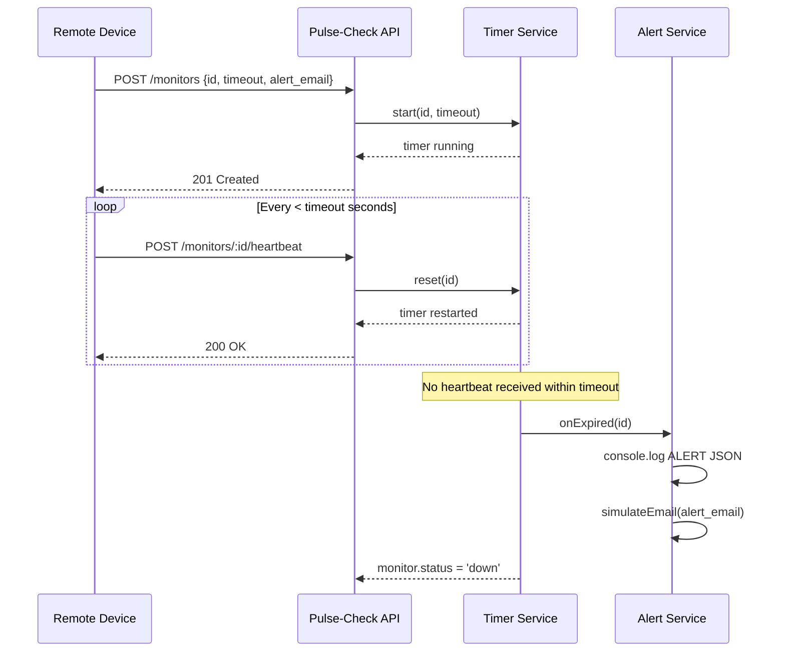

## Architecture Diagram

### Sequence Diagram — Normal Heartbeat Flow



---


## Project Structure

```
Pulse-Check/
├─── app.js                      - Express app entry point
│   ├── routes/
│   │   ├── monitors.js             - Monitor route definitions
│   │   └── system.js               - Health-check & root routes
│   ├── controllers/
│   │   └── monitorController.js    - HTTP -> service mapping
│   ├── services/
│   │   ├── monitorStore.js         - In-memory Map (singleton)
│   │   ├── timerService.js         - setTimeout lifecycle management
│   │   ├── monitorService.js       - Business logic orchestration
│   │   └── alertService.js         - Alert firing + email simulation
│   ├── middleware/
│   │   ├── requestLogger.js        - Per-request logging
│   │   ├── errorHandler.js         - Global error handler
│   │   └── notFound.js             - 404 catch-all
│   └── utils/
│       ├── validators.js           - Input validation (no external libs)
│       └── time.js                 - Centralised ISO timestamp
├── package.json
├── .gitignore
└── README.md
```
